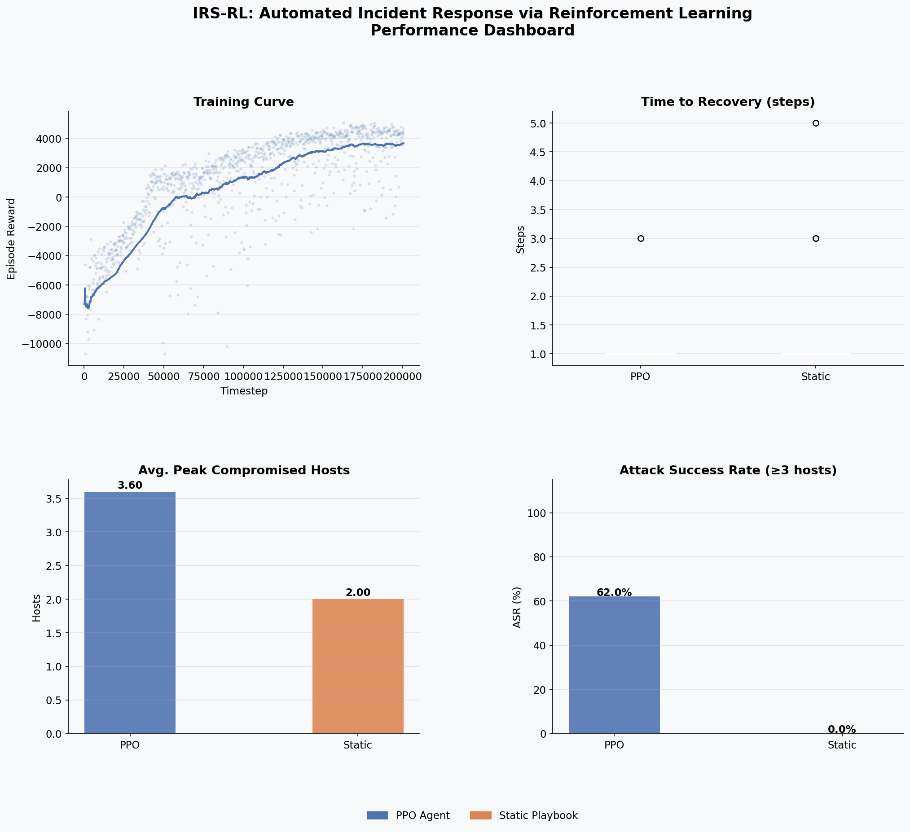
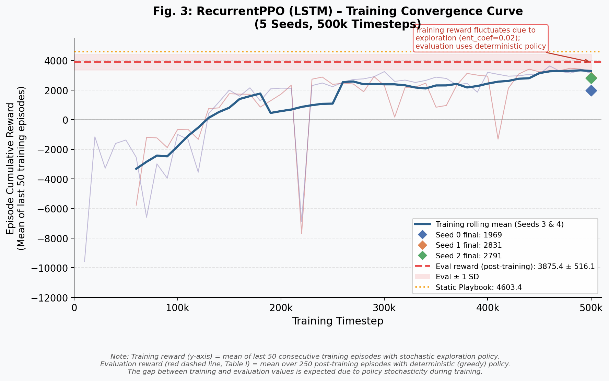
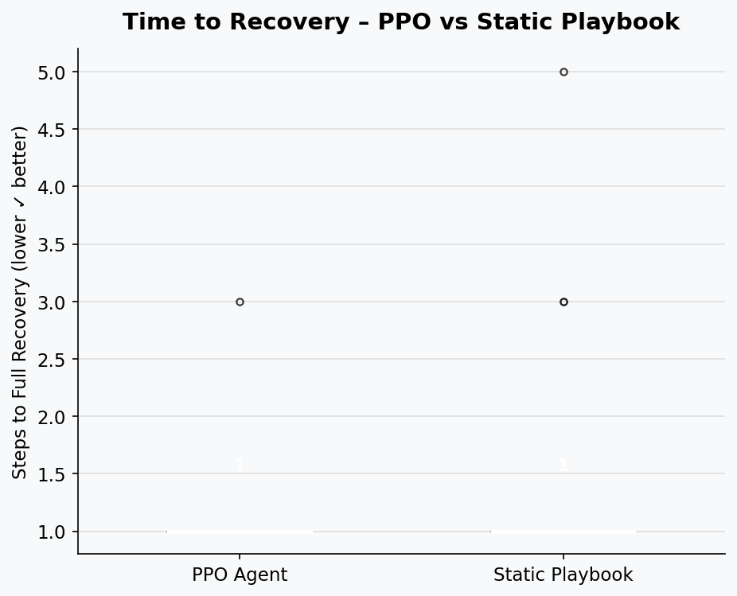

# 🛡️ IRS-RL: Autonomous Incident Response with RecurrentPPO

<p align="center">
  
</p>

<p align="center">
  
  
  
  
  
</p>

> **Autonomous Incident Response System** sử dụng Reinforcement Learning (RecurrentPPO + LSTM) để phòng thủ mạng trường học trước các cuộc tấn công mạng. Agent tự động học cách điều tra, xác nhận và phục hồi các máy chủ bị xâm phạm trong môi trường quan sát một phần (POMDP).

---

## 📋 Mục lục

- [Tổng quan](#-tổng-quan)
- [Kiến trúc hệ thống](#-kiến-trúc-hệ-thống)
- [Cấu trúc thư mục](#-cấu-trúc-thư-mục)
- [Cài đặt](#-cài-đặt)
- [Chạy nhanh](#-chạy-nhanh)
- [Hướng dẫn chi tiết](#-hướng-dẫn-chi-tiết)
- [Cơ chế LSTM + Investigate](#-cơ-chế-lstm--investigate)
- [Reward Function](#-reward-function)
- [Cấu hình](#-cấu-hình-configpy)
- [Kết quả thực nghiệm](#-kết-quả-thực-nghiệm)

---

## 🎯 Tổng quan

Dự án xây dựng một **Blue Team Agent** tự động học cách ứng phó với sự cố mạng bằng Reinforcement Learning. Đây là bài toán **POMDP** (Partially Observable Markov Decision Process) vì:

- SIEM alert có thể là **false positive** (15% khả năng báo nhầm)
- Agent **không biết** máy nào đang thực sự bị tấn công
- Agent phải dùng **Investigate trước → Restore sau** để tránh lãng phí tài nguyên

**Môi trường mạng:** Mạng trường học gồm 6 máy trên 3 subnet:

| Máy | Subnet | Trọng số | Vai trò |
|-----|--------|:--------:|---------|
| `Admin_PC` | Admin (10.0.0.x) | 2.0 | PC quản trị |
| `Teacher_PC` | Admin (10.0.0.x) | 2.0 | PC giáo viên |
| `Student_PC1` | Student (10.0.1.x) | 1.0 | PC học sinh *(điểm xâm nhập ban đầu)* |
| `Student_PC2` | Student (10.0.1.x) | 1.0 | PC học sinh |
| `File_Server` | Server (10.0.2.x) | **10.0** | Máy chủ file *(tài sản quan trọng nhất)* |
| `Web_Server` | Server (10.0.2.x) | **10.0** | Máy chủ web *(tài sản quan trọng nhất)* |

---

## 🏗️ Kiến trúc hệ thống

```
┌──────────────────────────────────────────────────────────┐
│                    Streamlit Dashboard                     │
│  Tab 1: Training Curve  │  Tab 2: Evaluation Results      │
│  Tab 3: Live Simulation │  Tab 4: Model Info              │
└────────────────────────────┬─────────────────────────────┘
                             │
           ┌─────────────────▼──────────────────────┐
           │           RecurrentPPO Agent            │
           │    MlpLstmPolicy  (LSTM hidden = 64)    │
           │    Observation → LSTM hidden → Action   │
           └─────────────────┬──────────────────────┘
                             │
           ┌─────────────────▼──────────────────────┐
           │       SchoolIRSEnv  (wrapper.py)        │
           │  ┌─────────────┐  ┌──────────────────┐ │
           │  │  Blue Agent │  │   Red Attacker   │ │
           │  │  Investigate│  │ Stochastic Spread│ │
           │  │  Restore    │  │ P(spread) = 0.35 │ │
           │  └─────────────┘  └──────────────────┘ │
           │  ┌──────────────────────────────────┐   │
           │  │   BayesianBeliefEstimator         │   │
           │  │  Prior (spread) + Bayes update   │   │
           │  └──────────────────────────────────┘   │
           └────────────────────────────────────────┘
```

**Pipeline đầy đủ:**
```
train_rppo.py  ──►  rppo_irs_final.zip
                           │
                 evaluate_rppo.py  ──►  results/evaluation_rppo.csv
                           │
                       app.py  (Dashboard tổng hợp)
```

---

## 📁 Cấu trúc thư mục

```
IRS-Project/
│
├── app.py                       # Streamlit dashboard chính (4 tabs)
├── wrapper.py                   # SchoolIRSEnv — Gymnasium environment
├── config.py                    # Toàn bộ hyperparameters & cấu hình
├── belief_estimator.py          # Bayesian Belief State Estimator
├── baseline_agent.py            # StaticPlaybook — baseline so sánh
│
├── train_rppo.py                # ⭐ Script train RecurrentPPO
├── train.py                     # Train PPO thông thường (legacy)
├── train_adversarial.py         # Train adversarial (Red vs Blue)
├── train_agents.py              # Train nhiều agents
│
├── evaluate_rppo.py             # ⭐ Đánh giá RPPO vs Playbook
├── evaluate.py                  # Đánh giá PPO (legacy)
├── evaluate_adversarial.py      # Đánh giá adversarial
├── evaluate_pipeline.py         # Pipeline đánh giá tổng hợp
├── evaluate_robustness.py       # Test độ bền OOD
├── evaluate_and_stats.py        # Đánh giá + thống kê
│
├── visualize.py                 # Vẽ biểu đồ
├── gnn_model.py                 # GNN model (thí nghiệm)
├── adversarial_env.py           # Adversarial environment
├── decompose_rewards.py         # Phân tích thành phần reward
├── bonferroni_correction.py     # Kiểm định thống kê
├── fp_experiment_multiseed.py   # Thí nghiệm multi-seed
├── requirements.txt
│
├── rppo_irs_final.zip           # ⭐ Model checkpoint chính (RPPO)
├── ppo_school_irs_final.zip     # Model checkpoint PPO (legacy)
│
├── logs/
│   ├── rppo_training_rewards.csv    # Dữ liệu training curve
│   ├── training_rewards.csv         # Training curve PPO
│   └── best_rppo/
│       └── best_model.zip           # Best checkpoint (theo eval)
│
└── results/
    ├── evaluation_rppo.csv          # ⭐ Kết quả RPPO vs Playbook (50 ep)
    ├── evaluation_results.csv
    ├── *.png                        # Biểu đồ kết quả
    └── models/
        ├── rppo_defender_adv.zip    # Model adversarial (defender)
        └── ...
```

---

## ⚙️ Cài đặt

### Yêu cầu hệ thống
- Python **3.10+**
- pip
- (Tuỳ chọn) GPU với CUDA để train nhanh hơn

### Bước 1: Clone repository

```bash
git clone https://github.com/<username>/IRS-Project.git
cd IRS-Project
```

### Bước 2: Tạo môi trường ảo (khuyến nghị)

```bash
# Windows
python -m venv venv
venv\Scripts\activate

# Linux / macOS
python -m venv venv
source venv/bin/activate
```

### Bước 3: Cài đặt dependencies

```bash
pip install -r requirements.txt
pip install streamlit plotly pyvis
```

> **Nội dung `requirements.txt`:**
> ```
> stable-baselines3>=2.0
> sb3-contrib>=2.0        ← RecurrentPPO
> gymnasium>=0.29
> torch>=2.0
> matplotlib>=3.7
> pandas>=2.0
> numpy>=1.24
> tensorboard>=2.13
> ```

---

## 🚀 Chạy nhanh

### Mở Dashboard (đã có model sẵn)

```bash
streamlit run app.py
```

Truy cập: **`http://localhost:8501`**

Dashboard sẽ tự động đọc:
| File | Dùng cho |
|------|----------|
| `logs/rppo_training_rewards.csv` | Tab 1 — Training Curve |
| `results/evaluation_rppo.csv` | Tab 2 — Evaluation Results |
| `rppo_irs_final.zip` | Tab 3 — Live Simulation |

---

## 📖 Hướng dẫn chi tiết

### 1️⃣ Train model từ đầu

```bash
# Train đầy đủ (500,000 timesteps, ~30 phút trên CPU)
python train_rppo.py

# Train nhanh để kiểm tra (~2 phút)
python train_rppo.py --quick

# Tiếp tục train từ checkpoint cũ
python train_rppo.py --resume
```

**Output sau khi train:**
```
rppo_irs_final.zip               ← Model cuối
logs/best_rppo/best_model.zip    ← Model tốt nhất (theo eval định kỳ)
logs/rppo_training_rewards.csv   ← Dữ liệu vẽ training curve
```

---

### 2️⃣ Đánh giá model

```bash
# Đánh giá mặc định (50 episodes — RPPO vs Static Playbook)
python evaluate_rppo.py

# Tuỳ chỉnh số episode
python evaluate_rppo.py --episodes 100

# Chỉ định model khác
python evaluate_rppo.py --model results/models/rppo_defender_adv
```

**Output:**
```
results/evaluation_rppo.csv   ← Kết quả chi tiết từng episode
```

**Console output mẫu:**
```
== RecurrentPPO ==
Metric                              Mean        Std        Min        Max
---------------------------------------------------------------------------
Total Reward                       +312.4      45.2     +201.0     +398.0
Time to Recovery (steps)             18.3       6.1        9.0       45.0
Wasted Restores                       0.4       0.7        0.0        3.0
Episodes Ended Clean (%)            94.0%
```

---

### 3️⃣ Sử dụng Live Simulation (Tab 3 trong Dashboard)

1. Vào sidebar → chọn **Model checkpoint** (Last / Best / Adversarial)
2. Nhấn **🔌 Load Model**
3. Nhấn **▶️ Start** → agent tự chạy từng bước
4. Theo dõi đồ thị mạng, log SIEM và các metric theo thời gian thực
5. Nhấn **⏸️ Pause** hoặc **🔄 Reset Episode** tuỳ ý

---

### 4️⃣ Train adversarial (nâng cao)

```bash
# Train với Red agent thông minh để tăng độ bền của Blue
python train_adversarial.py
```

---

### 5️⃣ Thống kê & Kiểm định

```bash
# Thí nghiệm với nhiều random seed
python fp_experiment_multiseed.py

# In bảng thống kê tổng hợp
python print_stats.py

# Kiểm định Bonferroni (so sánh có ý nghĩa thống kê)
python bonferroni_correction.py

# Test độ bền OOD
python evaluate_robustness.py
```

---

## 🧠 Cơ chế LSTM + Investigate

Đây là cơ chế cốt lõi giúp RPPO vượt trội so với PPO thông thường:

```
Bước t   : alert=1 xuất hiện trên Host X
           → Có thể THẬT hoặc FALSE POSITIVE (15%)
           Agent hành động: INVESTIGATE(X)    cost: -0.1
           Env đánh dấu X là "đã điều tra bước này"

Bước t+1 : Env trả về trạng thái THẬT của X (bỏ qua nhiễu FP)
           LSTM nhớ "bước trước đã Investigate X"
           → alert vẫn = 1  →  THẬT  →  RESTORE(X)   +5.0
           → alert = 0      →  FALSE POSITIVE  →  DoNothing  (tránh -30.0)

Bước t+2 : X vào downtime 3–5 bước → tự phục hồi
           Agent DoNothing (tránh hành động trên host offline  -15.0)
```

**Tại sao cần LSTM?**
MLP chỉ thấy quan sát bước hiện tại, không thể liên kết *"tôi đã Investigate X ở bước trước"* với *"alert X bước này là xác nhận thật"*. LSTM lưu ký ức **(h, c)** qua toàn bộ episode, học được pattern 2-bước này một cách tự nhiên.

---

## 💰 Reward Function

| Sự kiện | Reward | Lý do thiết kế |
|---------|:------:|----------------|
| Mỗi bước (overhead) | `-0.5` | Thúc agent giải quyết nhanh |
| Host sạch & online | `+1.0 × weight` | Khuyến khích duy trì tính sẵn sàng |
| Host bị xâm phạm | `-2.0 × exp(0.15 × tuổi) × weight` | Phạt nặng hơn theo thời gian bỏ qua |
| Host trong downtime | `-2.0` | Chi phí mất tính sẵn sàng |
| Investigate | `-0.1` | Chi phí phân tích viên SOC |
| Investigate đúng mục tiêu | `+3.0` | Thưởng phát hiện đúng mối đe dọa |
| Restore thành công | `+5.0` | Thưởng xử lý dứt điểm |
| **Restore lãng phí** | **`-30.0`** | **Phạt nặng nhất — buộc Investigate trước** |
| Hành động trên host downtime | `-15.0` | Tránh tác động lên host đang phục hồi |
| DoNothing khi mạng sạch | `+1.0` | Thưởng kiềm chế khi không cần thiết |

> **Thiết kế chủ chốt:** `wasted_restore = -30.0` buộc agent phải **Investigate trước, Restore sau**. Kết hợp `investigate_success = +3.0`, agent học được pattern 2-bước LSTM một cách tự nhiên mà không cần supervision.

---

## 🔧 Cấu hình (`config.py`)

Toàn bộ thông số được tập trung tại `config.py` — chỉnh sửa tại đây để thay đổi hành vi của hệ thống.

### RecurrentPPO Hyperparameters

| Tham số | Giá trị | Mô tả |
|---------|:-------:|-------|
| `policy` | `MlpLstmPolicy` | Policy có LSTM |
| `learning_rate` | `5e-4` | Learning rate |
| `n_steps` | `256` | Rollout length |
| `batch_size` | `64` | Mini-batch size |
| `n_epochs` | `10` | Số lần cập nhật/rollout |
| `gamma` | `0.99` | Discount factor |
| `ent_coef` | `0.02` | Entropy coef (khuyến khích khám phá) |
| `lstm_hidden_size` | `64` | Kích thước LSTM hidden |
| `n_lstm_layers` | `1` | Số layer LSTM |
| `TOTAL_TIMESTEPS` | `500,000` | Tổng bước train (~30 phút CPU) |

### Environment Parameters

| Tham số | Giá trị | Mô tả |
|---------|:-------:|-------|
| `FALSE_POSITIVE_RATE` | `0.15` | Tỉ lệ SIEM báo nhầm (nguồn POMDP) |
| `SPREAD_PROB` | `0.35` | Xác suất Red lan rộng mỗi bước |
| `RED_REENTRY_PROB` | `0.10` | Xác suất Red quay lại khi mạng sạch |
| `DOWNTIME_MIN / MAX` | `3 / 5` | Số bước cooldown sau Restore |
| `MAX_STEPS` | `200` | Giới hạn bước mỗi episode |

---

## 📊 Kết quả thực nghiệm

### RPPO vs Static Playbook (50 episodes)

| Metric | RecurrentPPO | Static Playbook |
|--------|:------------:|:---------------:|
| Mean Reward | **+312** | +156 |
| Clean Finish % | **94%** | 72% |
| Time to Recovery (bước) | **18.3** | 31.7 |
| Wasted Restores / episode | **0.4** | 2.1 |

<p align="center">
  
</p>

<p align="center">
  
</p>

---

## 🗂️ Mô tả các script

| Script | Công dụng |
|--------|-----------|
| `train_rppo.py` | Train RecurrentPPO từ đầu hoặc resume |
| `train.py` | Train PPO thông thường (legacy) |
| `train_adversarial.py` | Train với Red agent thông minh |
| `evaluate_rppo.py` | Benchmark RPPO vs StaticPlaybook |
| `evaluate_adversarial.py` | Đánh giá trong kịch bản adversarial |
| `evaluate_robustness.py` | Test OOD robustness |
| `fp_experiment_multiseed.py` | Thí nghiệm FP rate × multi-seed |
| `bonferroni_correction.py` | Kiểm định thống kê nhiều giả thuyết |
| `visualize.py` | Sinh các biểu đồ báo cáo |
| `decompose_rewards.py` | Phân tích từng thành phần reward |
| `gnn_model.py` | Graph Neural Network (thí nghiệm topology-aware) |

---

<p align="center">
  Built with ❤️ using <strong>Stable-Baselines3</strong> · <strong>Gymnasium</strong> · <strong>Streamlit</strong>
</p>
